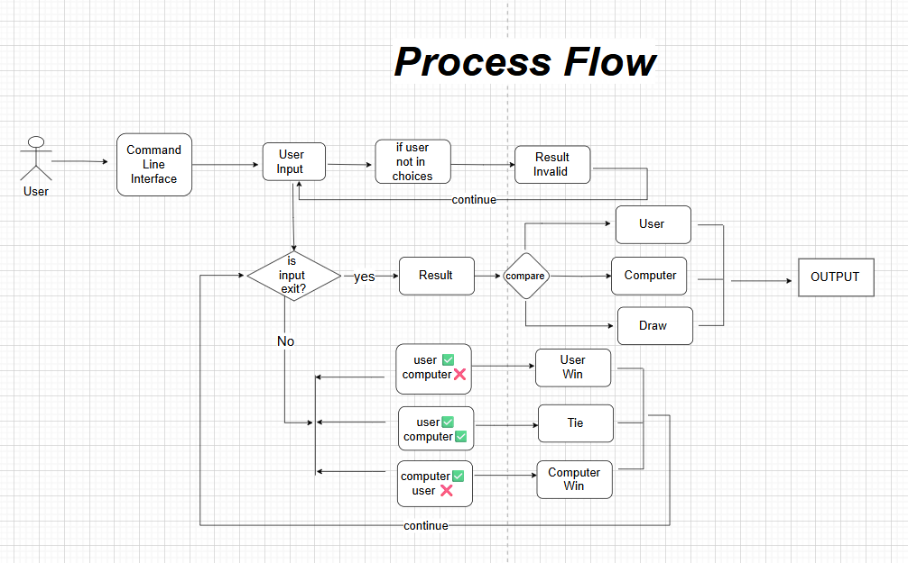
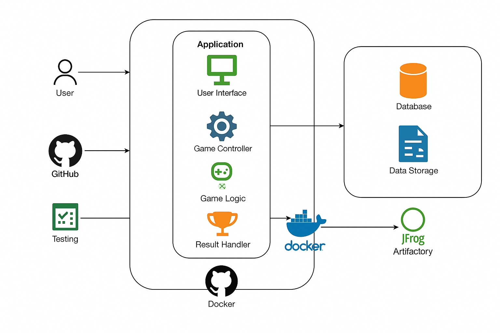
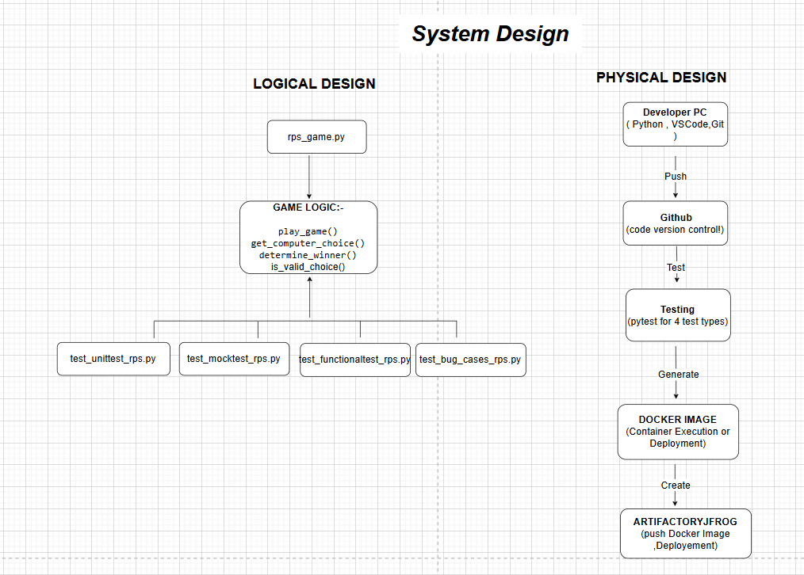
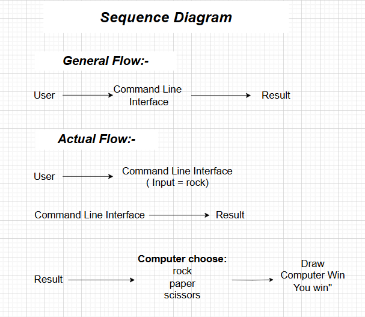

### Process Flow Diagram




### Architecture Diagram



### System Diagram




### Sequence Diagram



### Project Directory Tree :

```
📦 ROCK_PAPER_SCISSORS
├─ .gitignore
├─ Dockerfile
├─ Images
│  ├─ Architecture_RPS1.png
│  ├─ Process_Flow_RPS1.png
│  ├─ Sequence_Flow_RPS1.png
│  └─ System_Design_RPS1.png
│─ rps_game.py
│─ test_bug_cases_rps.py
├─ requirements.txt
├─ test_functionaltest_rps.py
├─ test_mocktest_rps.py
└─ test_unittest_rps.py
```
©generated by [Project Tree Generator](https://woochanleee.github.io/project-tree-generator)
